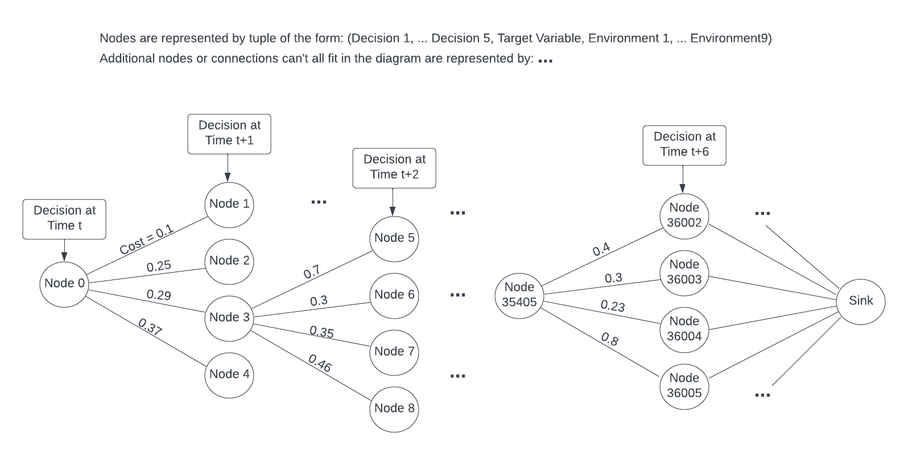
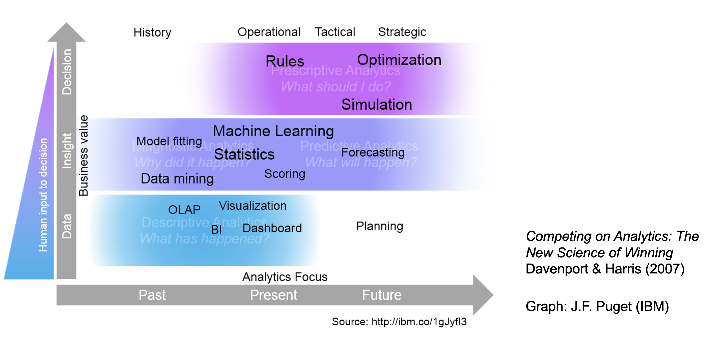

# smart factory

Machine Learning is a remarkably powerful tool for gaining insights into various processes. However, Machine Learning, on its own, does not provide explicit directives on the actions we should undertake given specific situations. Bridging this gap between insight generation and decision-making requires the integration of Machine Learning and Integer/Linear Programming. Yet, it's worth noting that Integer/Linear programming doesn't readily accommodate Machine Learning models as inputs, particularly non-linear ones. This notebook aims to illustrate one potential approach to combining Machine Learning and Integer/Linear Programming effectively.

