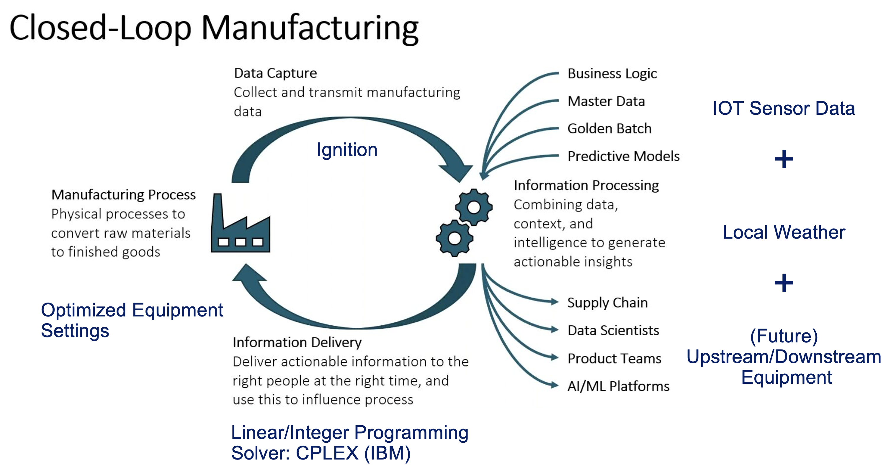
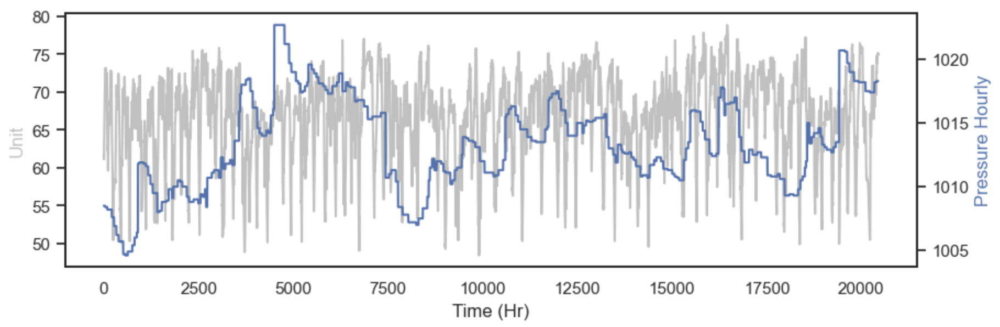
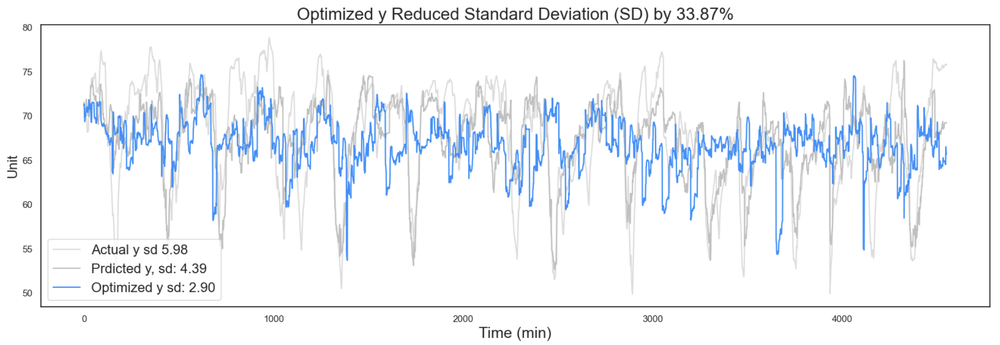

# Leveraging Machine Learning and Integer Programming for Enhanced Closed-Loop Manufacturing

Machine learning offers immense potential for insights extraction from various processes, though, alone, it doesn't provide explicit action directives for specific circumstances. Bridging this gap between insight generation and decision-making requires the integration of Machine Learning and Integer/Linear Programming. Yet, it's worth noting that Integer/Linear programming doesn't readily accommodate Machine Learning models as inputs, particularly non-linear ones. This notebook aims to illustrate one potential approach to combining Machine Learning and Integer/Linear Programming effectively.

## Drawing Parallels: Analytics Cycle and Closed Loop Manufacturing

Closed-loop manufacturing, or smart manufacturing, mirrors the typical analytics cycle closely. Internet of Things (IoT) data, collected via software like Ignition (by Inductive Automation), can initially be used to perform descriptive analytics, for instance, in the form of a dashboard. Subsequently, Machine Learning (ML), in conjunction with other data sources, is employed to derive insights and understand the data. Finally, these insights feed into optimization algorithms, like integer/linear programming, informing what decisions should be made or machine settings should be used based on varying circumstances.

## Gleaning Insights through Predictive Analytics
To exemplify this concept, we've employed an XGBoost regressor for training on a sample dataset, achieving an R^2 of 0.4 - 0.45. The visualization below compares predicted data points versus actual ones.

The following three charts depict the types of insights (relationships) that can be generated from applying ML on the dataset.

The feature importance graph indicates that besides time-related and machine setting features, the hourly pressure emerges as one of the most critical determinant for the target variable. As demonstrated below, the target variable generally mirrors the trend of the outdoor weather's hourly pressure.

It's also noteworthy that each machine setting (setting A, B, C…) exerts varying impacts on the target variable.

Time-related features prominently influence the process data, as they are usually time series. It can be observed that the hour of the day and day of the week correspond with fluctuations in the target variable.

## Enabling Prescriptive Analytics with Integer Programming
ML effectively enables us to comprehend our process data. However, the real question arises: what actions should we take based on these insights? For instance, if we acknowledge that weather impacts our process output, what machine settings should we adjust to counter this effect, particularly when machine settings A, B, C, and so on, all produce varying effects? Suppose we aim to reduce the standard deviation while also adhering to certain constraints, such as avoiding using the same machine settings consecutively.

Linear programming can help address these concerns, but it only accommodates linear inputs. While most powerful ML algorithms are predominantly non-linear, making linear programming not entirely straightforward for solving the issue, we can workaround this by pre-calculating the possible outcomes at each decision step using ML models and solve the decision space as a shortest path problem. 

The illustration below demonstrates this. The arc cost between the nodes essentially represent the predicted standard deviation for the machine to transition between the nodes. The program then identifies the shortest path from the starting node to the final node (sink). The connecting nodes along the shortest path represent the machine states necessary for minimizing the standard deviation.

The graph below shows the optimized decisions' results: we managed to reduce the standard deviation by 25% compared to previous actions.

The charts below compare the optimized machine settings (A, B, C, D, E) with the actual settings. Due to specific constraints implemented in the optimization algorithm (preventing the machine from operating too differently from previous runs), minimal changes are required on the machine side to implement these recommendations.

In conclusion, this project demonstrates the potential of smart manufacturing by employing both ML and operations research insights. As a proof of concept, it proposes a potential approach to actualize smart or closed-loop manufacturing. The process of forming and solving a decision space may resonate with the Markov reward process in reinforcement learning. Comparing reinforcement learning with the discussed approach can be an intriguing avenue for future exploration.

